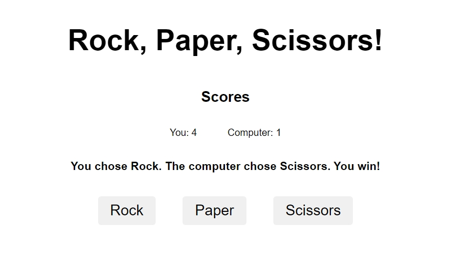

# Rock Paper Scissors Project

This is a **Rock Paper Scissors** project built as part of [The Odin Project](https://www.theodinproject.com/) Foundations curriculum. The project is divided into two parts, starting with a console-based game and later revisiting it to add an interactive graphical user interface (GUI).  

## Features

### Part 1: Console Version
- A fully functional Rock Paper Scissors game playable through the browser console.
- Tracks player and computer choices, determines the winner, and outputs results in the console.
- Implements random computer moves for fair gameplay.

### Part 2: GUI Version
- Enhanced with a visually appealing and interactive user interface.
- Buttons allow players to make their choices (Rock, Paper, or Scissors).
- Real-time display of game results on the webpage.
- Added animations and styling for an improved user experience.

## Project Preview



Try the live version of the project here: [Live Preview](https://gonalgar.github.io/rock-paper-scissors/)

## Technologies Used

- **HTML5**: Markup for structuring the game interface.
- **CSS3**: Styling and layout for both versions, including responsive design for GUI.
- **JavaScript**: Game logic, DOM manipulation, and event handling.

## Getting Started

To view or modify the project locally:

1. Clone this repository:
   ```bash
   git clone https://github.com/Gonalgar/rock-paper-scissors
   ```
2. Navigate to the project directory:
   ```bash
   cd rock-paper-scissors
   ```
3. Open the `index.html` file in your browser to view the game.  
   - Use the buttons and enjoy the interactive interface.

## What I Learned

- **Part 1**:
  - Writing game logic using JavaScript functions.
  - Using loops, conditionals, and variables effectively.
  - Debugging and testing game functionality in the browser console.

- **Part 2**:
  - Manipulating the DOM to create a dynamic and interactive interface.
  - Handling user events such as clicks and updating the UI in real time.
  - Designing and styling an engaging user interface with CSS.

## Acknowledgements

This project is part of [The Odin Project](https://www.theodinproject.com/paths/foundations/courses/foundations) Foundations curriculum. The two-part structure helped reinforce both basic JavaScript skills and DOM manipulation techniques.

## License

This project is open-source and available under the [MIT License](./LICENSE).